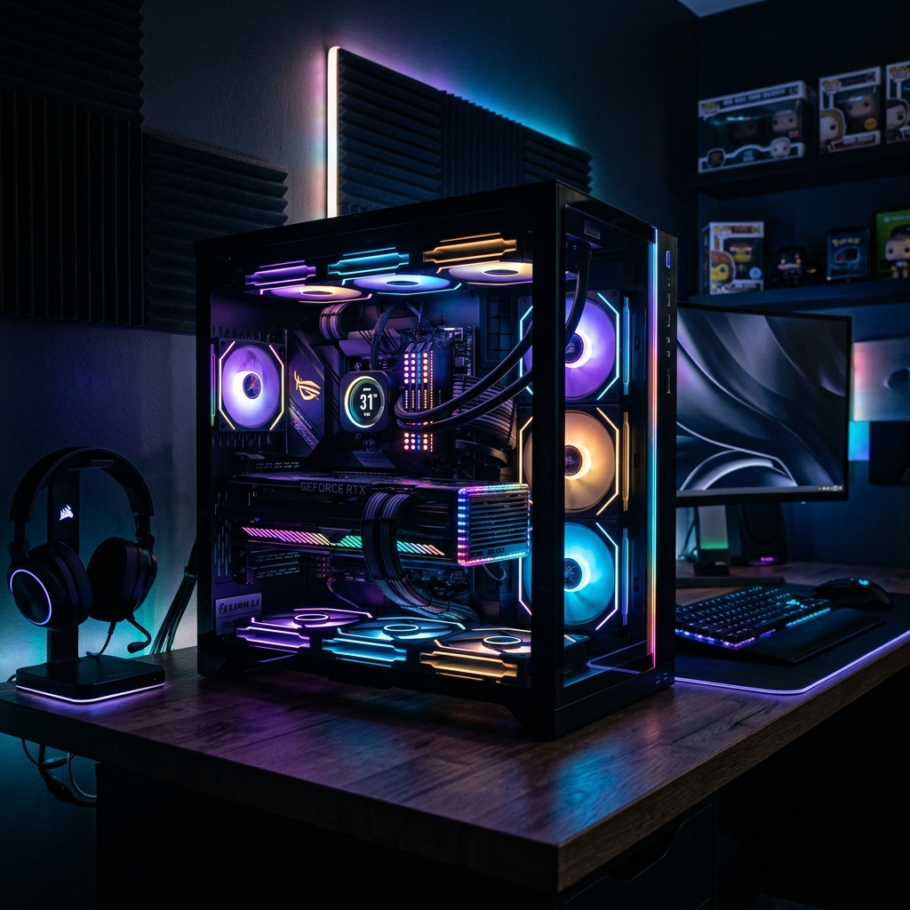

# 🖥️ PCBanaLo



**PCBanaLo** is a modern, responsive PC hardware configuration and building application. Whether you are looking for a pre-configured build tailored to your favorite game or workflow, or you want to hand-pick every component for a custom rig, PCBanaLo provides a seamless and guided experience.

## ✨ Features

- 🎯 **Use-Case Selection System**: Not sure where to start? Tell us your primary use case (Gaming vs. Work), select your target game or workflow (e.g., *Cyberpunk 2077* or *Video Editing*), and get a curated list of optimized PC builds with detailed pros and cons.
- 🛠️ **Custom Builder**: Build a PC from scratch. Select components across all major categories: CPU, Motherboard, GPU, RAM, Storage, Power Supply, and Case.
- ⚡ **Real-Time Compatibility Checks**: Never worry about incompatible parts. The builder warns you about:
  - CPU & Motherboard socket mismatches.
  - Motherboard & RAM generation mismatches (e.g., DDR4 vs DDR5).
  - Power Supply wattage sufficiency based on GPU power requirements.
- 💱 **Currency Conversion**: Instantly view prices in your local currency (Supports USD, INR, GBP, EUR, AUD).
- 🌓 **Theme Toggling**: Sleek glassmorphism UI with support for Light and Dark modes.

## 🚀 Tech Stack

- **Framework**: [React](https://react.dev/)
- **Language**: [TypeScript](https://www.typescriptlang.org/)
- **Bundler**: [Vite](https://vitejs.dev/)
- **Routing**: [React Router](https://reactrouter.com/)
- **Icons**: [Lucide React](https://lucide.dev/)
- **Styling**: Vanilla CSS with CSS Variables for theme management

## 📦 Getting Started

### Prerequisites

Make sure you have [Node.js](https://nodejs.org/) installed on your machine.

### Installation

1. Clone the repository:
   ```bash
   git clone https://github.com/Abhixarvar/PChardwaresite.git
   cd PChardwaresite
   ```

2. Install dependencies:
   ```bash
   npm install
   ```

3. Start the development server:
   ```bash
   npm run dev
   ```

4. Open your browser and navigate to `http://localhost:5173`.

## 🏗️ Project Structure

- `src/components/`: Reusable UI components (Select dropdowns, Part cards, etc.).
- `src/context/`: React context for managing the global builder state, selected components, and pricing.
- `src/data/`: Mock data for components and pre-configured builds.
- `src/hooks/`: Custom React hooks (e.g., `useTheme`).
- `src/pages/`: Main application pages (`Home.tsx`, `Builder.tsx`).

## 📄 License

This project is open-source and available under the [MIT License](LICENSE).
